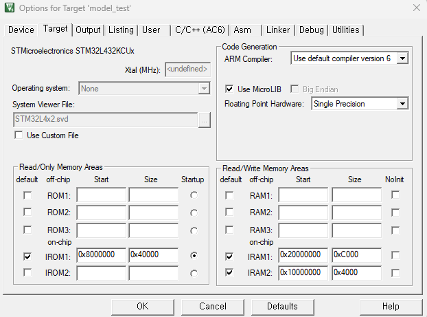
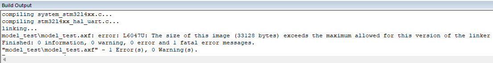
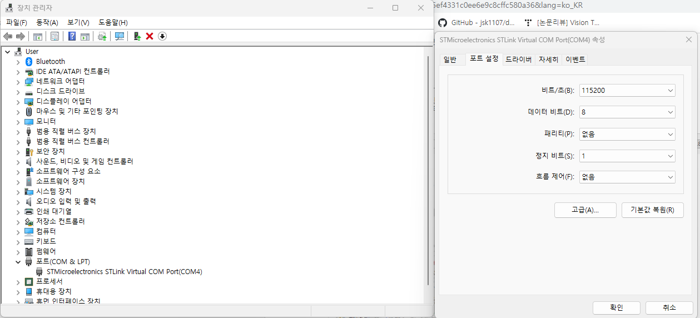
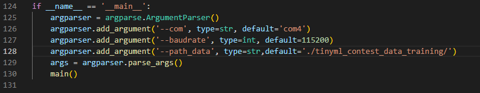
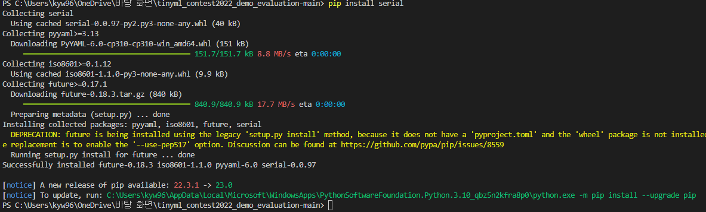
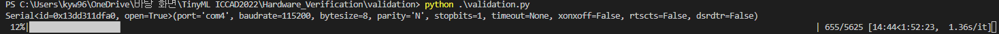

# TinyML Project

## Envionments
 * STM32CubeMX(https://www.st.com/en/development-tools/stm32cubemx.html)
 * MDK5-ARM(https://www2.keil.com/mdk5)
 * ST-Link Driver(https://www.st.com/content/my_st_com/en/products/development-tools/software-development-tools/stm32-software-development-tools/stm32-utilities/stsw-link009.license=1656325086116.product=STSW-LINK009.version=2.0.2.html)
 * STM32 Board (e.g. NUCLEO-L432KC)
 * Containing the structure and parameters of the learning model .onnx file (if trained by Pytorch)

## How to deploy training model?
 * **STM32CubeMX**  

  1. Open STM32CubeMX and click ***ACCESS TO BOARD SELECTER*** and select our board.

     

     

  2. Click ***Software Packs --- Manage Software Packs*** and 

     

     Click the check box of <u>Artifacial Intelligence( v7.1.0 )</u> under **X.CUBE.AI** and click ***Install Now.***

     

  3. Click ***Software Packs --- Select Components*** and set option as follow.

     

     

  4. The `TIM` must be enabled to perform accurate inference latency measurement: 
     

     Make sure the Parameter Settings are modified as the figure shown below:

     

  5. Set AI network

     First, set the communication options as follow

     

     Then click ***Add network*** and import ours model by follow steps shown in the picture.

     

     After choosing model, you can click ***Analyze*** to view the resources needed to run the model.

     

  6. Set Clock

     

  7. When generating code, make sure to select `Basic` option in `Application Structure`. 

     

     `TIM` in LL library should be selected in `Project Manager-Advance Settings`.

     

     In order to operate the header file later, don't forget to check option `Generate peripheral initialization as a pair of '.c/.h' files per peripheral` in the Code Generator when generating code.

     

  ## Load Program to Board
  
  1. After generating C source code based project, you should replace certain files in order to enable evaluation. All four files that should be replaced are provided. You could directly copy and paste the files from the folder `framework_x-cube-ai` to the generated project in Keil:

     1. **usart.c**
     2. **app_x-cube-ai.c**
     3. **app_x-cube-ai.h**
     4. **main.c**

  2. When build the project, make sure that you check `Use MicroLIB` in `Setting-Target-Code Generation`. 

     

  3. Connet the boadr to computer.

     

  4. Open project in MDK5 and build.

     
     
     * **If an error like <L6050U: The code size of this image exceeds the maximum allowed for this version...> occur, your model size should be reduced. The Lite version can only be compiled up to 32 Kb.**
     * **One way is to reduce the size by changing Optimization from C/C++ (Tap) to -Oz image size or -Os balanced in the Option. (But it's not going to be much.)**

  5. Check if the debugger is connected.

     First, click ***Options for Target***.

     

     Then switch to <u>Debug</u> and click ***Settings***.

     

     If the debugger is connected, you can see the IDCODE and the Device Name. 

     

     Finally, switch to <u>Flash Download</u> and check <u>Reset and Run</u>(option)

     

  6. Now you can load program to the board.

     

 * **MDK-ARM (Keil)**
 * After generating C source code based project, you should replace certain files in order to enable evaluation. You could directly copy and paste the files to the generated project in Keil.(four file - usart.c, app_x-cube-ai.c, app_x-cube-ai.h, main.c)
 * When build the project, make sure that you check Use MicroLIB in Setting  ->Target->Code Generation.
 * 
 * Click Build 
 * **If an error like <L6050U: The code size of this image exceeds the maximum allowed for this version...> occur, your model size should be reduced. The Lite version can only be compiled up to 32 Kb.**
 * 
 * **One way is to reduce the size by changing Optimization from C/C++ (Tap) to -Oz image size or -Os balanced in the Option. (But it's not going to be much.)**
 * Build is complete, you can now upload the model on the your board. 
 * Click Download button or F8

 * **Validation in python**
 * You need to set up before running on Python.
 * First, go to Device Manager in Windows.
 * On the Ports tab, check the number of COM ports the device is connected (e.g. (STMicroelectronics STLINK Virtual COM Port(COM4))).
 * And click STMicroelectronics STLINK Virtual COM Port to go to the Port Settings tab and change Bit/S(B) to 115200.
 * 
 * Then, you go down to the bottom of the validation.py file, you will see argparser codes like above. Here, '--com', '--path_data' must be modified.
 * com is the name of the port to which the board is connected, and path_data is the location of the data set that was used when learning.
 * 
 * **(The verification is conducted in the Windows environment, so you must download dataset to Windows and enter the location in default='path' path.)**
 * Finally, you must install the required Python library before running.(serial, numpy, scikit-learn, tqdm, pyserial)
 * "pip install serial numpy scikit-learn tqdm pyserial"
 * 
 * **If an error such as "ERROR: Error [WinError 225]" occurred during installation, shut down the Windows Defender and all vaccines.**
 * When you finish installing the library, you can run it through "python validation.py" 
 * Finally, press the Reset button located at the top of the board to start verification.
 * 
